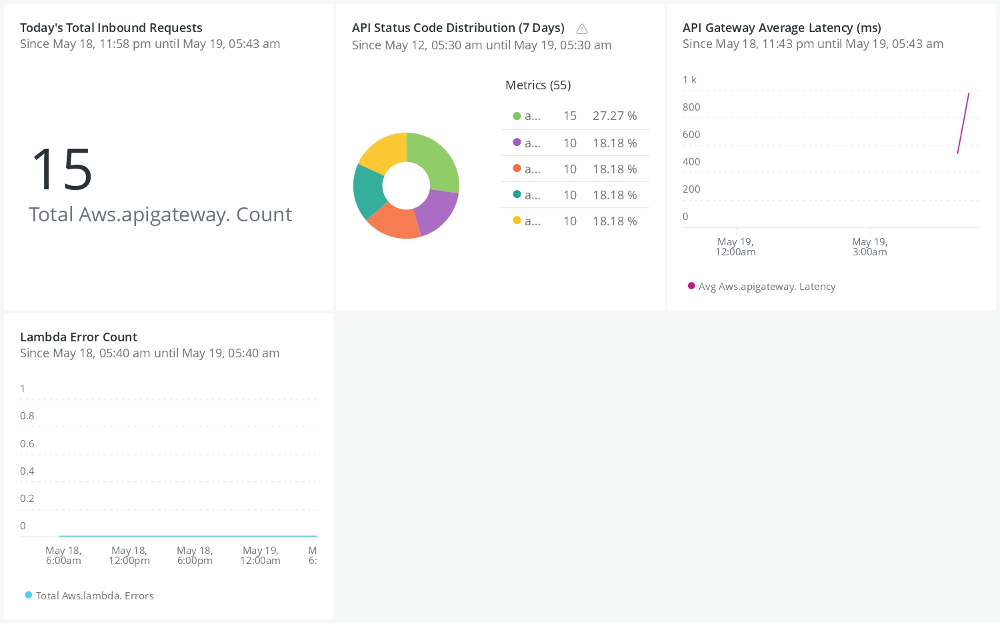

# Cloud Resume Challenge - Backend (Visitor Counter API)


このリポジトリは、[Cloud Resume Challenge](https://github.com/ooooosuke/cloud-resume-challenge) のバックエンドインフラおよび API ロジックを管理するためのものです。

Terraform を使用したInfrastructure as Code(IaC)と、GitHub Actions による CI/CD パイプライン を備えたサーバーレスアーキテクチャで構成されています。


## 🏗️ Architecture

1.  API Gateway: ブラウザからの HTTPS POST リクエストを受信。

2.  AWS Lambda (Python): DynamoDB の値をインクリメントし、現在の訪問者数を返却。

3.  Amazon DynamoDB: 訪問者数をアトミックに保存・管理。

4.  GitHub Actions: コードのプッシュをトリガーに、テスト・インフラ構築・デプロイを自動実行。


## 📂 Directory Structure


```text

cloud-resume-backend/

├── .github/workflows/
│   └── backend-ci.yml      # テスト実行 \& Terraform自動デプロイ
├── infra/                  # Terraform (IaC) 構成ファイル
│   ├── main.tf             # AWSプロバイダ、S3バックエンド(tfstate)定義
│   ├── variables.tf        # 変数定義 (region, env, project\_name)
│   ├── dynamodb.tf         # DynamoDBテーブル定義
│   ├── lambda.tf           # Lambda関数、IAMロール、権限定義
│   ├── api\_gateway.tf      # API Gateway (CORS設定含む)
│   └── outputs.tf          # APIエンドポイントの出力
├── lambda/                 # Lambdaソースコード
│   └── lambda\_function.py  # 訪問者数カウントロジック (Python)
├── tests/                  # 自動テスト関連
│   ├── test\_api.py         # APIスモークテスト
│   └── requirements.txt    # テスト用依存ライブラリ
└── README.md               # 本ファイル

```


## 🛠️ Technology Stack

Cloud: AWS (ap-northeast-1)

IaC: Terraform v1.x

Language: Python 3.12

CI/CD: GitHub Actions (OIDC 認証)

Testing: Pytest / Requests


## 🚀 Getting Started

### 1. Prerequisites

Terraform の状態管理（tfstate）用 S3 バケットが AWS 上に作成されていること。

GitHub Actions 用の IAM ロール (OIDC) が作成され、適切な権限が付与されていること。

### 2. GitHub Secrets の設定

リポジトリの Settings > Secrets and variables > Actions に以下のシークレットを登録

### 3. Local Deployment (Manual)

ローカルから手動でデプロイする場合は以下を実行します。

Bash
```text
cd infra
terraform init
terraform plan
terraform apply
```

## 🔄 CI/CD Pipeline

main ブランチへのプッシュをトリガーに、以下のジョブが自動実行されます。

Checkout: ソースコードの取得。

Configure AWS Credentials: OIDC を使用して AWS への一時的なアクセス権を取得。

Zip Lambda: Python コードを zip 形式に圧縮。

Terraform Init \& Apply: インフラの変更差分を検出し、AWS 環境を最新化。

Smoke Test: デプロイされた API が正しく 200 OK を返し、カウントが増加するかを検証。


## 🛡️ Security \& Best Practices

OIDC Authentication: 長期的な AWS アクセスキーを排除し、GitHub OIDC による一時的な認証情報を採用。

Minimal Privilege: Lambda の IAM ロールには、特定の DynamoDB テーブルへのアクセス権限のみを付与（最小権限の原則）。

CORS Configuration: ブラウザからのクロスオリジンリソース共有を適切に設定。


## 📊 New RelicによるAWS監視
**API Gateway/Lambda → CloudWatch → Firehose → New Relic**

1.生成 (API Gateway/Lambda → CloudWatch)
* **役割**: ユーザーがレジュメにアクセスしてAPIが叩かれた際、実行ログやパフォーマンス（処理時間・エラー率など）がCloudWatch Metricsに自動的に書き込まれるフェーズ。
* **設定**: 基本的に自動生成。コスト最適化のため、不要なログ出力やリソースの精査を行う箇所。

2.ストリーム (CloudWatch → Firehose)
* **役割**: CloudWatchに溜まったメトリクスを、リアルタイムに次のFirehoseへ押し出す（Pushする）パイプライン。
* **設定**: CloudWatchの `Metric Streams` で設定。コスト最適化のため、送信対象を `AWS/ApiGateway` と `AWS/Lambda` のみに絞り込むフィルターを設定。

3.送信 (Firehose → New Relic)
* **役割**: 受け取ったメトリクスデータを、外部のNew Relicのダッシュボードへ暗号化して流し込む最終配送フェーズ。
* **設定**: Firehose側に以下の通り認証キーとカスタムパラメータを設定。

| 設定項目 | 属性 | Key | Value | 役割 / 備考 |
| :--- | :--- | :--- | :--- | :--- |
| Access key | AWS標準の認証枠 | 設定なし | `NRAL-******` <br>*(New Relicの INGEST - LICENSE キー)* |データを送信する先の外部サービス（New RelicやDatadogなど）のパスワードやAPIキーを、AWSの標準機能として安全に格納する場所　|
| Parameters | New Relic専用ヘッダー | `X-License-Key` | `NRAL-******` <br>*(上記と同じ INGEST - LICENSE キー)* |送信先であるNew Relic側が指定している「データの送り状（ヘッダー）」の名前|




 追加作成済のメトリクス
- API Gateway の総リクエスト数（カウントアップの可視化）
SQL
> SELECT sum(`aws.apigateway.Count`) FROM Metric TIMESERIES


- Lambda の平均実行時間（レイテンシーの監視）
SQL
> SELECT average(`aws.lambda.Duration`) FROM Metric TIMESERIES


- Lambda のエラー発生数（健全性の証明）
SQL
> SELECT sum(`aws.lambda.Errors`) FROM Metric TIMESERIES

[^1]: 障害時切り分け　APIGWのREST API（POSTメソッド）に空のJSONデータを送信し、結果を取得するコマンド
> Invoke-RestMethod -Uri "https://xxxx.execute-api.ap-northeast-1.amazonaws.com/prod/getcount" -Method Post -ContentType "application/json" -Body '{}'


## ✍️ Author

- Ousuke Furuta
- Infrastructure Engineer

## 📚 References

Cloud Resume Challenge Official Website - https://cloudresumechallenge.dev/


